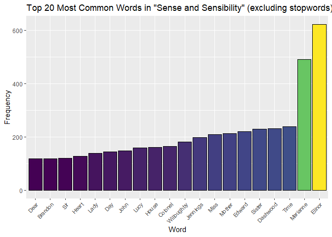

Assignment_B4
================
Jacky Yiu
2023-12-02

## Prerequisites

Please install the following libraries

``` r
library(dplyr)
```

    ## Warning: package 'dplyr' was built under R version 4.3.2

    ## 
    ## Attaching package: 'dplyr'

    ## The following objects are masked from 'package:stats':
    ## 
    ##     filter, lag

    ## The following objects are masked from 'package:base':
    ## 
    ##     intersect, setdiff, setequal, union

``` r
library(janeaustenr)
```

    ## Warning: package 'janeaustenr' was built under R version 4.3.2

``` r
library(ggplot2)
```

    ## Warning: package 'ggplot2' was built under R version 4.3.2

``` r
library(tidytext)
```

    ## Warning: package 'tidytext' was built under R version 4.3.2

``` r
library(testthat)
```

    ## Warning: package 'testthat' was built under R version 4.3.2

    ## 
    ## Attaching package: 'testthat'

    ## The following object is masked from 'package:dplyr':
    ## 
    ##     matches

``` r
library(viridis)
```

    ## Loading required package: viridisLite

``` r
library(stringr)
```

    ## Warning: package 'stringr' was built under R version 4.3.2

# Option A – Strings and functional programming in R

## **Exercise 1 (37.5 points) - Jane Austen Word Count**

For this exercise I pick the novel “Sense and Sensibility” from the
`janeaustenr` library.

I will first make `janeaustenr::sensesensibility` into a tibble to see
what the data looks like.

``` r
sensesensibility_tibble <- tibble(txt = sensesensibility)
sensesensibility_tibble
```

    ## # A tibble: 12,624 × 1
    ##    txt                    
    ##    <chr>                  
    ##  1 "SENSE AND SENSIBILITY"
    ##  2 ""                     
    ##  3 "by Jane Austen"       
    ##  4 ""                     
    ##  5 "(1811)"               
    ##  6 ""                     
    ##  7 ""                     
    ##  8 ""                     
    ##  9 ""                     
    ## 10 "CHAPTER 1"            
    ## # ℹ 12,614 more rows

It seem like every row contain sentence instead of inidvidual words, To
convert the sentence into individual words and ignore all punctuation
and white space, I will use the function `unnest_tokens` from the
`tidytext` package.

It also make all word lower case so it does discriminate uppercase and
lower case words.

``` r
sensesensibility_words <- tidytext::unnest_tokens(sensesensibility_tibble, word, txt)
head(sensesensibility_words)
```

    ## # A tibble: 6 × 1
    ##   word       
    ##   <chr>      
    ## 1 sense      
    ## 2 and        
    ## 3 sensibility
    ## 4 by         
    ## 5 jane       
    ## 6 austen

As per the exercise requirement, I will use remove “stop words” from the
book using the list from `tidytext::stop_words`

I will use anti-join to exclude all words in `sensesensibility_word`
that is also in `tidytext::stop_words`

``` r
sensesensibility_no_stopwords <- anti_join(sensesensibility_words , tidytext::stop_words, by="word")
head(sensesensibility_no_stopwords)
```

    ## # A tibble: 6 × 1
    ##   word       
    ##   <chr>      
    ## 1 sense      
    ## 2 sensibility
    ## 3 jane       
    ## 4 austen     
    ## 5 1811       
    ## 6 chapter

Next, I will find out the Top 20 words using the following code, than
use `str_to_title` from the `stringr` package to capitalize wach word to
make it more pretty

``` r
sensesensibility_no_stopwords_top_words <- sensesensibility_no_stopwords %>%
  count(word, sort = TRUE) %>%
  top_n(20)
```

    ## Selecting by n

``` r
sensesensibility_no_stopwords_top_words$word <- str_to_title(sensesensibility_no_stopwords_top_words$word)
sensesensibility_no_stopwords_top_words
```

    ## # A tibble: 20 × 2
    ##    word           n
    ##    <chr>      <int>
    ##  1 Elinor       623
    ##  2 Marianne     492
    ##  3 Time         239
    ##  4 Dashwood     231
    ##  5 Sister       229
    ##  6 Edward       220
    ##  7 Mother       213
    ##  8 Miss         210
    ##  9 Jennings     199
    ## 10 Willoughby   181
    ## 11 Colonel      165
    ## 12 House        161
    ## 13 Lucy         160
    ## 14 John         148
    ## 15 Day          144
    ## 16 Lady         138
    ## 17 Heart        127
    ## 18 Sir          120
    ## 19 Brandon      119
    ## 20 Dear         118

Finally, using GGplot, histogram, we can visualize the data.

``` r
ggplot(sensesensibility_no_stopwords_top_words, aes(x = reorder(word, n), y = n, fill = n)) +
  geom_col(color = "black", show.legend = FALSE) +
  labs(title = "Top 20 Most Common Words in \"Sense and Sensibility\" (excluding stopwords)",
       x = "Word",
       y = "Frequency") +
  scale_fill_viridis_c()+
  theme(axis.text.x = element_text(angle = 45, hjust = 1, size = 8))
```

<!-- -->

## **Exercise 2 (37.5 points) Pig Latin**

I define my customized Pig Latin function with the following rules:

1.  If the word begins with a vowel and end with vowel, append”oodle” to
    every vowel.

2.  If the word begins with a vowel and end with consonant,
    append”oodle” to every vowel , and add “acky” to the end. .

3.  If the word begins with a consonant, move the first consonant to the
    end and the last letter to the beginning, append”oodle” to every
    vowel and add “-acky” to the end.

``` r
#' Custom Pig Latin Transformation
#'
#' This function transforms a word into Pig Latin based on my customized Pig Latin function with the following rules:
#' 
#' 1. If the word begins with a vowel and ends with a vowel, append "oodle-" to every vowel.
#' 2. If the word begins with a vowel and ends with a consonant, append "oodle-" to every vowel and add "acky" to the end.
#' 3. If the word begins with a consonant, move the first consonant to the end and the last letter to the beginning, append "oodle-" to every vowel, and add "acky" to the end.
#' 
#' The function also ensures that if the original word is capitalized, the transformed word will also be capitalized.
#' 
#' @param word A character string representing the input word (must be a single word).
#' 
#' @return A character string representing the word transformed into Pig Latin.
#' 
#' @examples
#' customPigLatin("Example")
#' # Returns: "Eoodle-Xoodle-Mpleoodle"
#' 
#' @export

customPigLatin <- function(word) {
  # Ensure that the input is a character string
  if (!is.character(word) || length(word) != 1) {
    stop("Input must be a character string.")
  }
  
  # Ensure that the input is a single word
  if (length(str_split(word, "\\s")[[1]]) > 1) {
    stop("Input must be a single word.")
  }
  
  # Define a vector of vowels
  vowels <- c("a", "e", "i", "o", "u")

  # Check if the first letter is capitalized
  is_capitalized <- str_detect(word, "^[A-Z]")
  
  original <- tolower(word)

  # Extract the first letter of the word
  first_letter <- substr(original, 1, 1)

  if (first_letter %in% vowels) {
    # Rule 1: Word begins with a vowel and ends with a vowel
    if (substr(original, nchar(original), nchar(original)) %in% vowels) {
      # Append "oodle-" to every vowel
      result <- str_replace_all(original, "[aeiou]", "\\0oodle-")
    } else {
      # Rule 2: Word begins with a vowel and ends with a consonant
      # Append "oodle-" to every vowel and add "acky" to the end
      result <- str_replace_all(original, "[aeiou]", "\\0oodle-") %>%
        str_c("acky")
    }
  } else {
    # Rule 3: Word begins with a consonant
    # Move the first consonant to the end and the last letter to the beginning
    # Append "oodle-" to every vowel and add "acky" to the end
    first_consonant <- str_extract(original, "[^aeiou]")
    last_letter <- substr(original, nchar(original), nchar(original))
    middle_letters <- str_sub(original, 2, nchar(original) - 1)
    
    result <- str_c(last_letter, middle_letters, first_consonant) %>%
              str_replace_all("[aeiou]", "\\0oodle-") %>%
              str_c("acky")
  }

  # Use str_replace to remove a hyphen at the end of the word
  result <- str_replace(result, "-$", "")

  # Capitalize the first letter if the original word is capitalized
  if (is_capitalized) {
    result <- paste0(toupper(substr(result, 1, 1)), substr(result, 2, nchar(result)))
  }

  return(result)
}
```

Here are some example

``` r
#Example
word1 <- "apple" #Start and end with vowel (RULE 1)
word2 <- "table" #Start with consonant and end with vowel (RULE 3)
word3 <- "Elephant" #Start with vowel, end with with consonant (RULE 2)
word4 <- "Dog" #Start and end with consonant (RULE 3)

pig_latin_result1 <- customPigLatin(word1)
pig_latin_result2 <- customPigLatin(word2)
pig_latin_result3 <- customPigLatin(word3)
pig_latin_result4 <- customPigLatin(word4)

cat(sprintf("Original: %s, Pig Latin: %s\n", word1, pig_latin_result1))
```

    ## Original: apple, Pig Latin: aoodle-ppleoodle

``` r
cat(sprintf("Original: %s, Pig Latin: %s\n", word2, pig_latin_result2))
```

    ## Original: table, Pig Latin: eoodle-aoodle-bltacky

``` r
cat(sprintf("Original: %s, Pig Latin: %s\n", word3, pig_latin_result3))
```

    ## Original: Elephant, Pig Latin: Eoodle-leoodle-phaoodle-ntacky

``` r
cat(sprintf("Original: %s, Pig Latin: %s\n", word4, pig_latin_result4))
```

    ## Original: Dog, Pig Latin: Gooodle-dacky

Next we create various non-redundant test cases

``` r
test_that("Custom Pig Latin Transformation", {
  
  # Test with a phrase instead of a single word
  non_single_word <- "Hello world"
  expect_error(customPigLatin(non_single_word), "Input must be a single word.")
  
  # Test with a number instead of charater
  non_character <- 5486546
  expect_error(customPigLatin(non_character), "Input must be a character string.")
  
  # Rule 1: Word begins with a vowel and ends with a vowel
  input_word_1 <- "able"
  expected_result_1 <- "aoodle-bleoodle"
  actual_result_1 <- customPigLatin(input_word_1)
  expect_equal(actual_result_1, expected_result_1)

  # Rule 2: Word begins with a vowel and ends with a consonant
  input_word_2 <- "Ironman"
  expected_result_2 <- "Ioodle-rooodle-nmaoodle-nacky"
  actual_result_2 <- customPigLatin(input_word_2)
  expect_equal(actual_result_2, expected_result_2)

  # Rule 3: Word begins with a consonant
  input_word_3 <- "Tiger"
  expected_result_3 <- "Rioodle-geoodle-tacky"
  actual_result_3 <- customPigLatin(input_word_3)
  expect_equal(actual_result_3, expected_result_3)
})
```

    ## Test passed 🥳
